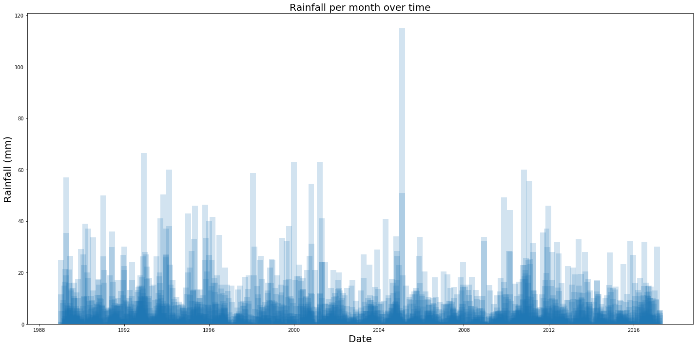
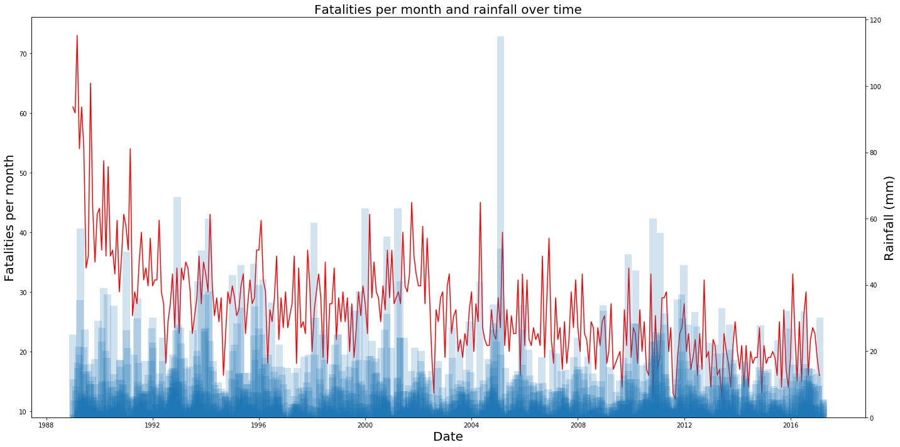

# INFO1903 Project
## Section I: Data analysis
### Domain Situation
For this project, I wanted to analyse state rainfall data
alongside road fatalities, with the primary aim of finding
a correlation between the two.

### Data Sources
#### Online Sources
- [The Australian Road Deaths Database](http://data.gov.au/dataset/australian-road-deaths-database/resource/ca07c8e3-672f-4826-a6e5-83fd7127ae0b)) which contains information about the crashes and the fatalities.
- [The Bureau of Meteorology's Daily Rainfall Data](http://www.bom.gov.au/jsp/ncc/cdio/weatherData/av?p_nccObsCode=136&p_display_type=dailyDataFile&p_startYear=&p_c=&p_stn_num=086039) for the station of Flemington in Victoria.

#### Download Links:
- [Crash database](https://bitre.gov.au/statistics/safety/files/Fatal_Crashes_Feb2017.csv) (csv)
- [Crash database legend](https://bitre.gov.au/statistics/safety/files/ARDD_Dictionary_V3.pdf) (pdf)
- [Rain database](http://www.bom.gov.au/jsp/ncc/cdio/weatherData/av?p_display_type=dailyZippedDataFile&p_stn_num=086039&p_c=-1480557288&p_nccObsCode=136&p_startYear=2017) (csv)

#### Data Description
##### ARDD

| Column | Type | Description |
| --- | --- | --- |
| `crashid` | `character(13)` | Internal crash ID |
| `state` | `character varying(3)` | State that the crash occured in |
| `day` | `integer` | Day of the crash |
| `month` | `character varying(10)` | Month of the crash (long name format) |
| `year` | `integer` | Year of the crash |
| `hour` | `integer` | Hour of the crash |
| `minute` | `integer` | Minute of the crash |
| `crashtype` | `character` varying(16) | Internal type of the crash |
| `fatalities` | `integer` | Number of fatalities |
| `bus` | `boolean` | Was a bus involved? |
| `heavytruck` | `boolean` | Was a heavy truck involved? |
| `articulatedtruck` | `boolean` | Was an articulated truck involved? |
| `speedlimit` | `integer` | The speed limit of the crash |

##### BOM Rainfall

| Column | Type | Description |
| --- | --- | --- |
| `year` | `integer` | Year of the measurement |
| `month` | `integer` | Month of the measurement (in integer form) |
| `day` | `integer` | Day of the measurement |
| `rainfall` | `double precision` | Amount of rainfall |
| `period` | `integer` | Period measured |
| `quality` | `character(1)` | Quality of data |

### Analysis
After setting up the data, I first graphed the rainfall over time and the crashes over time to see if I could spot any trends among the separate graphs:
#### Car Crashes per Month

As you can see, the number of car crashes per month has reduced significantly.

The spike at the start is because of the Kempsey Bus Crash, cited as the most deadly road accident in Australia's history. ([Wikipedia Article](https://en.wikipedia.org/wiki/Kempsey_bus_crash))
#### Monthly Rainfall

There is an outlier around 2005, a heavy rain event. ([BOM report](https://bom.gov.au/climate/annual_sum/2005/page13-15.pdf))

#### Crashes and Rainfall over Time
After having graphed the data separately, I graphed them on top of each other to get a better idea at a correlation:

## Section II: Data Generation
### Getting the data
### Storing in PostgreSQL
### Querying
### Graphing
